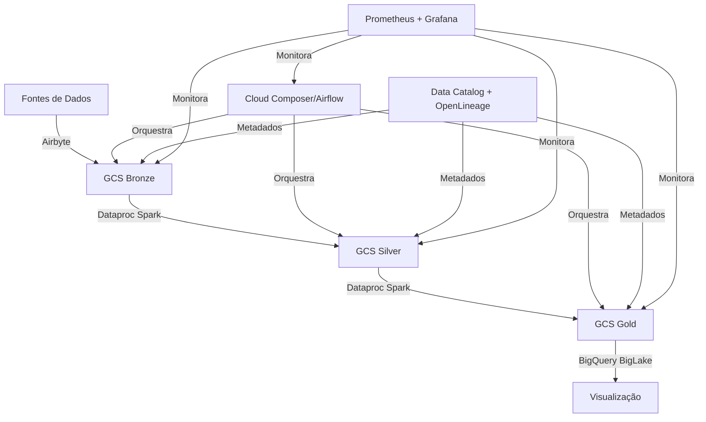

# Arquitetura do Pipeline de Dados para Análise de Inadimplência

## Visão Geral
Este documento descreve a arquitetura implementada para o pipeline de análise de inadimplência, baseado no padrão Lakehouse com camadas bronze, silver e gold no Google Cloud Platform (GCP).

## Componentes Principais

### 1. Ingestão de Dados (Airbyte)
- **Responsabilidade**: Extrair dados das fontes e carregá-los na camada bronze
- **Implementação**: Configurações Airbyte para conectores de arquivos JSON
- **Orquestração**: Através do Cloud Composer (Airflow)
- **Detalhes técnicos**: 
  - Utiliza um conector File Source para ler arquivos JSON
  - Configurado para monitorar um bucket GCS específico
  - Execução programada via Airflow para garantir consistência

### 2. Armazenamento de Dados
- **Camada Bronze**: 
  - Dados brutos em formato JSON/Iceberg no GCS
  - Propósito: Preservar dados originais sem modificação
  - Particionamento: Sem particionamento específico nesta camada
  
- **Camada Silver**: 
  - Dados limpos e tipados em formato Parquet no GCS
  - Propósito: Dados normalizados e validados
  - Particionamento: Por data de ingestão (`dt_ingest`)
  - Transformações: Limpeza, conversão de tipos, remoção de duplicados
  
- **Camada Gold**: 
  - Dados com regras de negócio aplicadas em formato Iceberg no GCS
  - Propósito: Dados prontos para análise de negócio
  - Particionamento: Por indicador de inadimplência (`inadimplente`)
  - Agregações: Métricas de inadimplência calculadas

- **Metastore**: 
  - Dataproc Metastore para gerenciar metadados das tabelas Iceberg
  - Garante transações ACID e evolução de esquema

### 3. Processamento (Apache Spark)
- **Bronze → Silver**: 
  - Script: `bronze_to_silver.py`
  - Funções: Limpeza, normalização e validação de dados
  - Características: 
    - Tipagem correta de colunas
    - Remoção de registros inválidos e duplicados
    - Mascaramento de dados sensíveis (LGPD)
    - Validação via Great Expectations

- **Silver → Gold**: 
  - Script: `silver_to_gold.py`
  - Funções: Aplicação de regras de negócio de inadimplência
  - Regras implementadas:
    - Critério 1: Atraso > 30 dias após período de 3 meses
    - Critério 2: Atraso > 15 dias em período de 6 meses
    - Cálculo de métricas agregadas por cliente

- **Infraestrutura**: 
  - Dataproc Serverless para processamento sob demanda
  - Escalabilidade automática baseada na carga
  - Otimizado para custo-eficiência

### 4. Orquestração (Apache Airflow via Cloud Composer)
- **DAGs**: 
  - `etl_inadimplencia.py`: Fluxo completo de processamento
  - Sequência de tarefas:
    1. Ingestão via Airbyte
    2. Transformação Bronze → Silver
    3. Transformação Silver → Gold
    4. Validação de qualidade de dados

- **Agendamento**: 
  - Execução diária às 2:00 AM
  - Retry automático em caso de falhas

- **Monitoramento**: 
  - Integração com sistema de alertas
  - Notificações por email em caso de falhas

### 5. Governança e Qualidade
- **Metadados**: 
  - Google Data Catalog para catalogação
  - Tags para classificação de dados sensíveis
  - Integração com políticas de acesso IAM

- **Linhagem**: 
  - OpenLineage para rastreamento de linhagem de dados
  - Captura de metadados de execução para auditoria

- **Qualidade**: 
  - Great Expectations para validação de dados
  - Validações aplicadas em múltiplos pontos do pipeline

### 6. Visualização e Análise
- **BigQuery BigLake**: 
  - Interface SQL para consulta dos dados
  - Tabelas externas apontando para dados no GCS

- **Looker Studio**: 
  - Dashboards de negócio
  - Visualização de métricas de inadimplência

- **Grafana**: 
  - Monitoramento técnico do pipeline
  - Métricas de desempenho e saúde

## Decisões Arquiteturais

### Formato de Armazenamento
- **Parquet**: 
  - Formato colunar para otimizar consultas analíticas na camada Silver
  - Suporte a compressão para reduzir custos de armazenamento
  - Leitura eficiente para processamento em batch

- **Iceberg**: 
  - Formato de tabela para garantir transações ACID na camada Gold
  - Suporte a evolução de esquema
  - Integração com Spark e BigQuery

### Particionamento
- **Camada Silver**: 
  - Particionamento por data de ingestão para otimizar limpezas
  - Facilita políticas de retenção e historização

- **Camada Gold**: 
  - Particionamento por flag de inadimplência para otimizar consultas de análise
  - Melhora desempenho de queries frequentes por este critério

### Segurança e Governança
- **IAM**: 
  - Controle de acesso granular por camada e função
  - Service accounts dedicados por componente

- **Mascaramento**: 
  - Aplicado a dados PII como CPF e emails
  - Implementado na camada Silver durante transformação

- **Criptografia**: 
  - Dados sensíveis criptografados em repouso
  - Implementação via configurações do GCS

- **LGPD**: 
  - Classificação de dados sensíveis via Data Catalog
  - Políticas de acesso baseadas em tags
  - Rastreabilidade completa de dados pessoais

## Fluxo de Dados

1. **Ingestão**: 
   - Arquivos JSON chegam ao bucket de landing (`landing-bucket`)
   - Formato esperado: Transações e Pagamentos em estrutura JSON

2. **Detecção**: 
   - Cloud Function detecta novos arquivos
   - Trigger para iniciar processo de ingestão

3. **ETL Bronze**: 
   - Airbyte move os dados para a camada Bronze
   - Preservação do dado original sem modificações

4. **ETL Silver**: 
   - Spark processa e limpa os dados para a camada Silver
   - Conversão de tipos, validação e mascaramento de dados sensíveis

5. **ETL Gold**: 
   - Spark aplica regras de negócio de inadimplência
   - Criação de tabelas particionadas por status de inadimplência
   - Cálculo de métricas agregadas

6. **Exposição**: 
   - BigQuery BigLake expõe os dados para consulta
   - Dashboards em Looker Studio para análise de negócio

## Implementação e Operação

### Provisionamento de Infraestrutura
- Terraform para infraestrutura como código
- Módulos para cada componente da arquitetura
- Variáveis para ambientes diferentes (dev, staging, prod)

### CI/CD
- Integração contínua para validação de código
- Deploy automatizado para ambientes de teste
- Validação de qualidade de código e testes unitários

### Monitoramento e Operação
- Grafana + Prometheus para monitoramento técnico
- Alertas configurados para falhas críticas
- Runbooks para procedimentos operacionais

## Escalabilidade e Evolução

### Capacidade de Escala
- Componentes serverless para escalabilidade automática
- Particionamento otimizado para volumes maiores
- Processamento distribuído com Spark

### Plano de Evolução
- Migração para streaming real-time (Kafka + Spark Streaming)
- Implementação de ML para previsão de inadimplência
- Expansão para mais fontes de dados